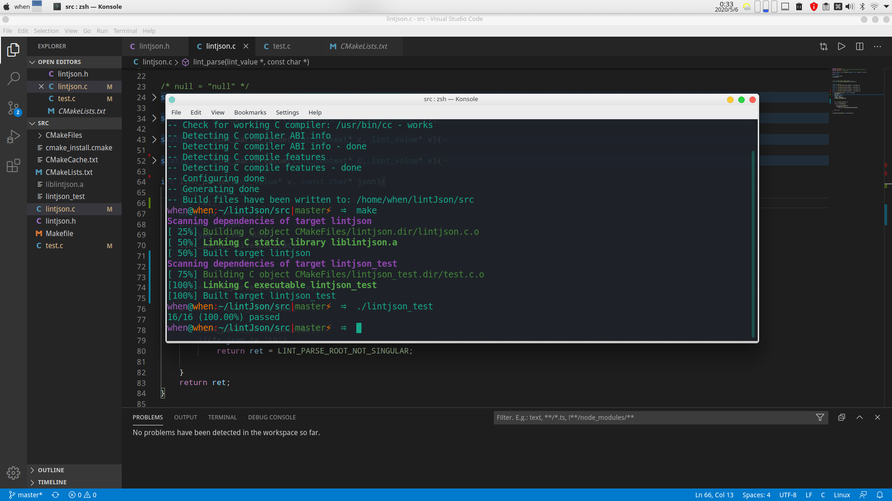
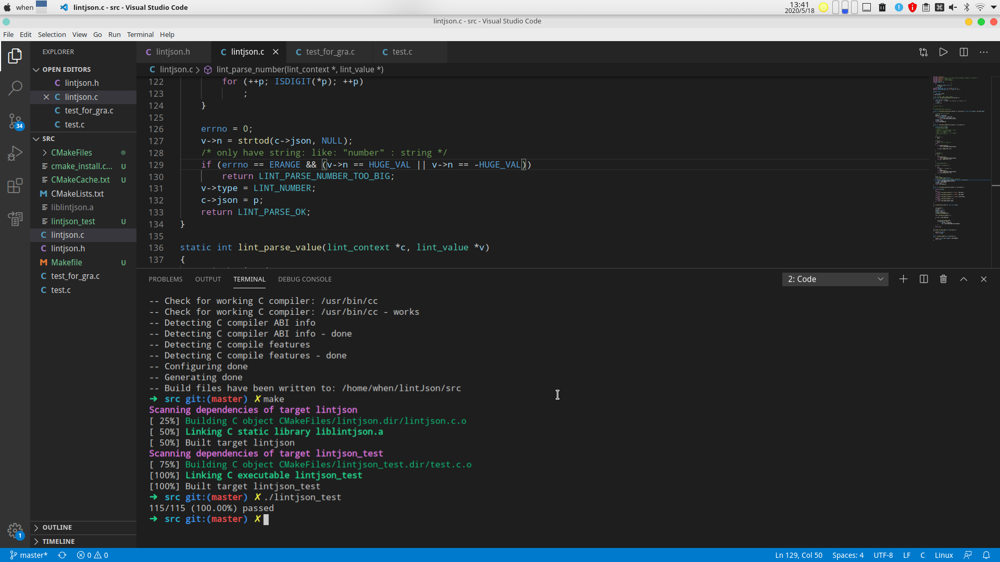

# lintJson 

### BRIEF
* A `JSON` parser with less than 600 lines codes 
* Written by `C`
* The most elegant code I've ever written

### LOG

2020/5/6:

first build successful:

2020/5/18:

can parse: double\ NULL\ TRUE\ FALSE

### RECORD

* [Notes](Note/Note.md)